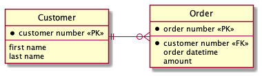
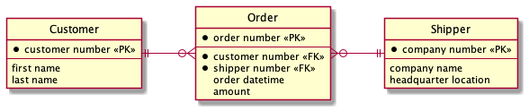
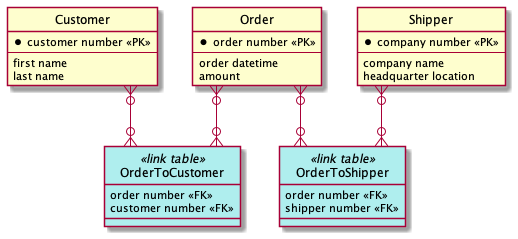
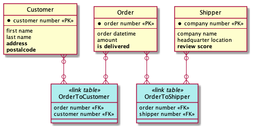
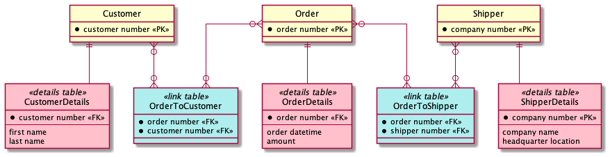
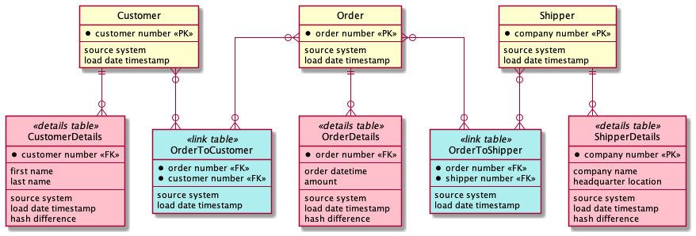
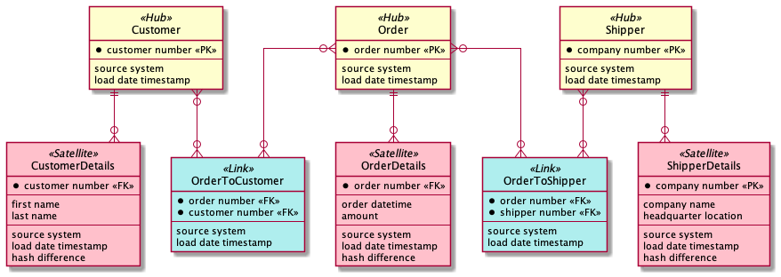
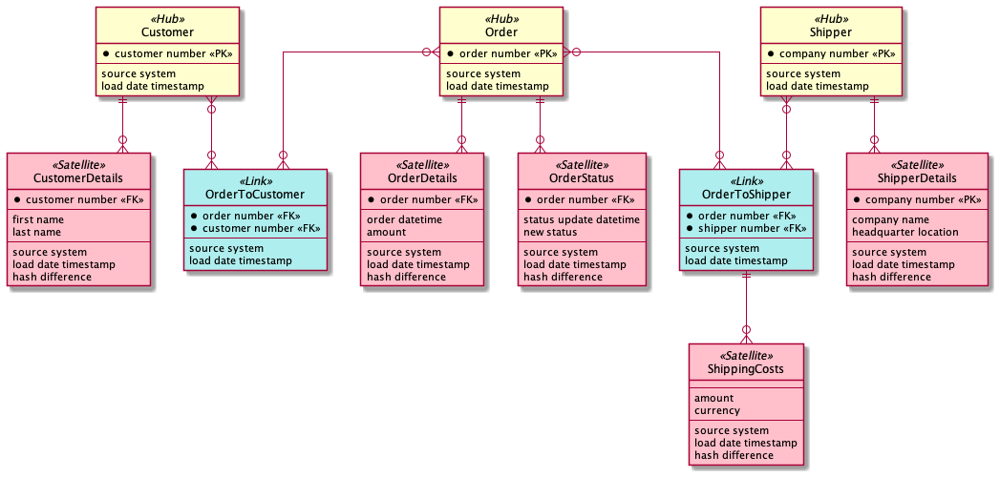
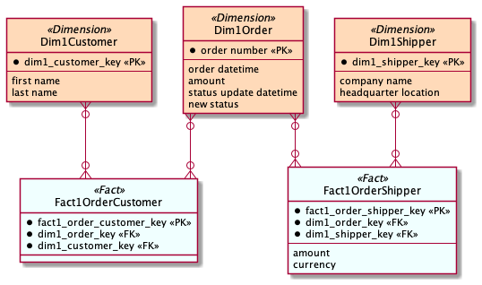

# Cracking the vault: our first take-aways from Data Vault Modelling
By Bjorn van der Laan

As part of ING's global finance and risk function, we currently building a new data warehouse to provide better access to front-office data for regulatory and strategic purposes.

Fundamental to a data warehouse is it's data model and we were looking for a modelling method that fits our agile way of working, satisfies our performance requirements, and allows us to have a historized view on any piece of data that ever entered.
Before long, we identified Data Vault modelling as a potential candidate.
The first thing that I like to do when exploring a concept is to visit my good friend Wikipedia.
I was happy to hear that our favorite online encyclopedia indeed contains a page on [Data Vault](https://en.wikipedia.org/wiki/Data_vault_modeling), where it essentially emphasizes four key points:

1. Data Vault Modeling is a database modeling method that is designed to provide 
**long-term historical storage** of data coming in from multiple operational systems.
2. The modeling method is designed to be **resilient to change** in the business environment where the data being stored is coming from, by explicitly separating structural information from descriptive attributes. 
3. Data vault is designed to **enable parallel loading** as much as possible, so that very large implementations can scale out without the need for major redesign.
4. **Hybrid** between [3rd Normal Form](https://en.wikipedia.org/wiki/Third_normal_form) and [Dimensional Modelling](https://en.wikipedia.org/wiki/Dimensional_modeling).

Judging from these points, the modelling approach could clearly fit our requirements.
That sounds great, but how does it work?

In this article, we embark on a journey to visit some of Data Vault's main lessons using a simple data model. We start our adventure with a simple data model. Along the way, challenges will arise and we will see how our protagonist Data Vault tackle these. 

## Three lessons of Data Vault
Below we see the model that we will gradually evolve. The model is displayed as an [Entity-Relationship model](https://en.wikipedia.org/wiki/Entity%E2%80%93relationship_model).
We have *Customers* that are identified by a customer number and they can place *Orders* which this data model will capture. These *Orders* are identified by an order number and they also contain a foreign key reference to the *Customer* that placed the *Order*.
Nothing to special for now, but bear with me.



We mentioned that we develop our data warehouse in an iterative way. 
Imagine that after some time new requirements arise and suddenly we also need to capture the courier that ships the order to our *Customer*. 
Framed in data modelling language: what if we want to add another one-to-many relation?
The most straightforward way is to add a new entity *Shipper* and relate it with *Order*.



However, this requires adding new foreign key column to *Order* while, preferably, you want to keep your entities stable.
How would Data Vault solve this?

```
Data Vault lesson #1
"Model all relationships as many-to-many relations."
```

The actual entity tables then do not contain foreign keys anymore, which allows us to add new entities and connect them through new links to existing entities without changing the existing entities. Conversely, if we ever want to delete an entity we can remove its link tables and there is again no impact on surrounding entities. 
This gives us flexibility and also enables parallel loading. The result of applying this lesson to our model is seen below.



That seems like an improvement already, but what if we now want to add more descriptive attributes?
As new requirements come in, we want to extend our entities and store more descriptive information about them. Our current data model requires us to alter the existing table, as is shown in the updated model below.



Similar to the relationships, altering existing tables is not our preference. We are lucky to find that Data Vault has a lesson for us to tackle this scenario too.

```
Data Vault lesson #2
"Split business keys and descriptive attributes."
```

Data Vault prescribes that descriptive attributes are put into separate tables that reference the primary key of the entity (or relationship) they describe. We can now update the structure and the information separately. 



Using the first two lessons, we can now safely change relationships and descriptive attributes of our model. We would now be good if we only needed to keep track of the current state of the data. 
An entity and its details table now maintain a 1-1 relationship. If an update comes in, the details table row would be overwritten, but a data warehouse should keep track of the history of data to allow consumers to inspect the situation at any historical point in time and to identify trends over periods of time. 
What would Data Vault do to keep track of historical changes to descriptive data? 

```
Data Vault lesson #3
Model as a 1-N relation and add meta data.
```

Each table in Data Vault has a field that records the **source that the data originated** from and a field containing the **load date timestamp**. We can now track changes to entities over time and also see where the changes came from.



The data model above is already a compliant Data Vault model.
The only step we still need to take is to use propper language.
In Data Vault we have three types of tables: **Hubs, Links and Satellites**. These work exactly as the tables we have seen. Hubs capture the **business key** (one or more fields) that uniquely identify a specific instance of that entity, Links capture the **relationships** between entities, and Satellites contain **descriptive information**. If we perform the translation, we obtain the Data Vault model below.



## Transforming Data Vault into a Dimensional Model
Data Vault is a great structure for a data warehouse to store the data, but its not very intuitive for end users and BI tools. Therefore, we create [data marts](https://en.wikipedia.org/wiki/Data_mart) from our Data Vault model that present the data in a  structure desired by the consumers. Data Vault is designed to be easily transformed into Star Schemas (Facts and Dimensions). If we follow the Data Vault standard the transform queries always follow the same pattern, which means we can automate the creation of data marts. Two rules of thumb apply here:
- If we merge a **Hub and its Satellite(s)** then we get a **Dimension**.
- If we merge a **Link and its Satellite(s)** then we get a **Fact**.

To show how this works, we show the template query to create a Dimension type 1 table from our *Customer* hub and its satellites below.

```sql
SELECT HUB.HUB_CUSTOMER_KEY AS DIM1_CUSTOMER_KEY,
	HUB.CUSTOMER_NUMBER, <-- primary key of Hub
	SAT.FIRST_NAME, <-- descriptive attribute of Sat
	SAT.LAST_NAME, <-- descriptive attribute of Sat

FROM HUB_CUSTOMER HUB, SAT_CUSTOMER_DETAILS SAT

WHERE HUB.CUSTOMER_NUMBER = SAT.CUSTOMER_NUMBER

// Dim type 1 so only the most recent record for each business key
AND SAT.LOAD_DTS = 
(
    SELECT MAX(SAT2.LOAD_DTS)
    FROM SAT_CUSTOMER_NAME SAT2
    WHERE HUB.CUSTOMER_NUMBER = SAT2.CUSTOMER_NUMBER
)
```

If we apply template queries such as the one above, we can present our Data Vault model to our users in a dimensional form that is intuitive to them.
Let's see what that looks like. Below we spiced things up slightly by expanding our data model to include two extra scenarios: a hub with multiple satellites and a link with a satellite.



If we run our template queries, we obtain the dimensional model below. The model contains two fact tables with each two dimensions.



## Conclusion
In this article, we introduced the basics of Data Vault modelling. 
Starting with a simple model, we learned three lessons that this modelling method applies:

1. Model all relationships between entities as many-to-many relations.
2. Split business keys and descriptive attributes
3. Model the relation between an entity and its details table as a 1-N relation and add meta data about loading.

We also saw how a Data Vault model can be transformed into a business-friendly dimensional model.
Essentially, Data Vault modelling and dimensional modelling are two sides of the same coin: Data vault is good for storing dimensional models and dimensional models is good for exposing data vault models for business users. We can convert from 'the storage model' to 'a consumable model' using standardized queries. In that way we can get all the loading benefits of Data Vault and all the consumption benefits from Dimensional models.
